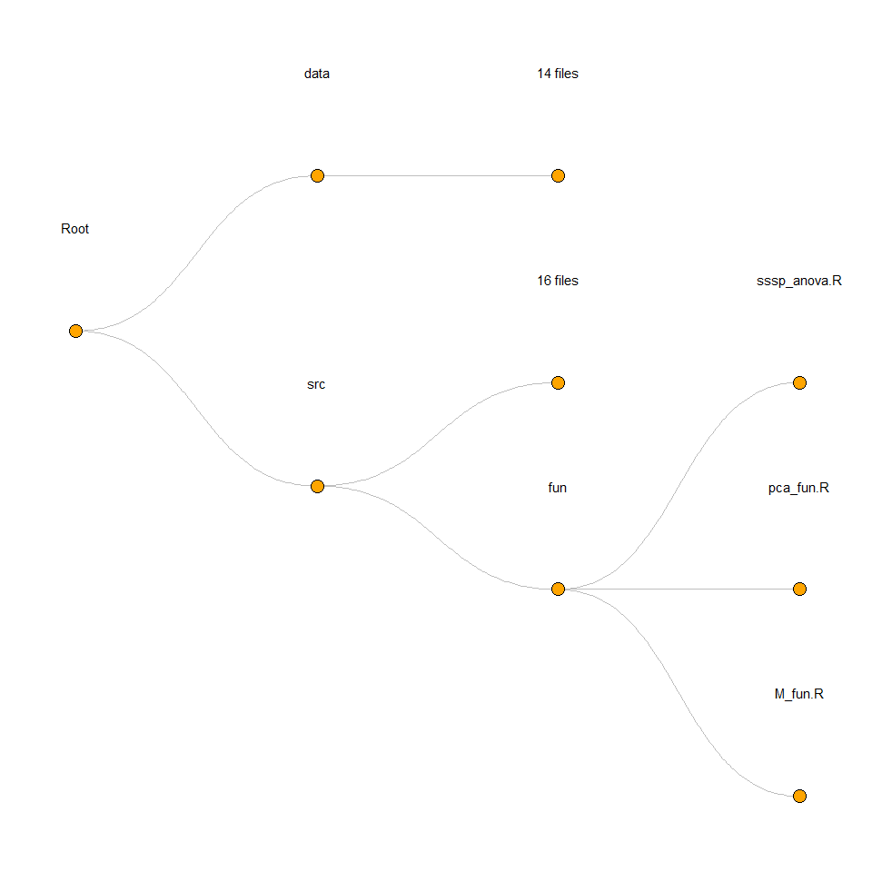

<!-- README.md is generated from README.Rmd. Please edit that file -->

# [Modern elite winter wheat cultivars use two physiological pathways to achieve yield stability]()

<!--  -->

## instruction

1.  open `JXB_Analysis.RProject`
2.  open `src/run.R`
3.  run all `Ctrl + Alt + R`

## directory tree

<!-- -->
